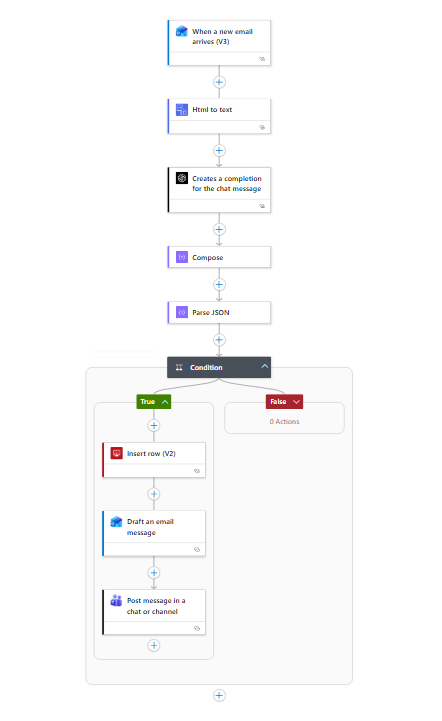

# AI Email Automation Assistant

AI-powered customer support automation workflow built using Azure Logic Apps, Azure OpenAI, SQL Database, and Microsoft Outlook.

## Features

- AI email classification
- Customer issue extraction
- Automated draft reply generation
- SQL ticket storage
- Branded HTML email responses
- Teams notifications
- Structured JSON parsing
- Logic Apps workflow automation

## Architecture

[architecture diagram]

## Workflow Overview

1. Customer email arrives
2. Logic Apps trigger activates
3. Azure OpenAI analyzes email
4. AI extracts structured data
5. Data stored in SQL database
6. Draft response generated
7. Teams notification sent

## Tech Stack

- Azure Logic Apps
- Azure OpenAI
- Azure SQL Database
- Microsoft Outlook
- Microsoft Teams

## Screenshots




## Example AI Output

```json
{
  "customer_name": "Sarah Lim",
  "order_id": "ORD-28471",
  "issue_type": "Damaged Item",
  "urgency": "High",
  "summary": "Customer received damaged notebooks.",
  "professional_reply": "Dear Sarah..."
}
